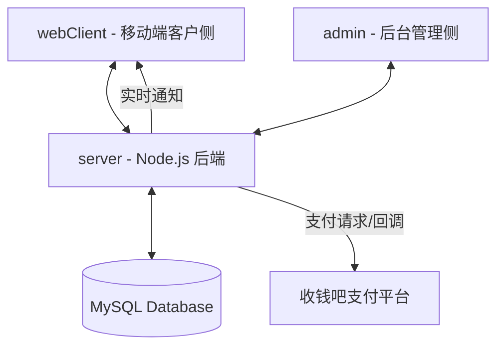

# Byzy 校服管理与支付系统项目文档

## 1. 项目概述
本项目是一个全栈式的管理与交易系统，旨在解决学校校服的订购、支付及分发管理。系统通过对接“收钱吧”支付平台实现线上支付，并具备实时支付状态通知及数据自动化导入功能。

## 2. 系统核心架构
项目采用前后端分离架构，由三个子系统组成：

---

## 3. 子系统详细介绍

### 📂 `server` (核心后端服务)
作为整个系统的中枢，负责业务逻辑处理、数据库控制及第三方集成。

- **核心技术栈**：Node.js + Express + TypeORM + MySQL + WebSocket。
- **关键模块**：
    - **PaymentService**: 封装收钱吧 VSI 接口。实现基于 MD5 的请求签名及基于 RSA-SHA256 的支付回调验签。
    - **ImportService**: 负责复杂的事务性数据导入，将学校、产品、学生及订单数据进行关联写入。
    - **WebSocketService**: 提供即时通讯能力，当支付成功时，后端主动向前端推送 `PAYMENT_SUCCESS` 消息，实现页面零延迟跳转。
    - **Currency Handling**: 采用国际标准，数据库全面使用“分”存储金额，规避浮点数计算误差。

### 📂 `admin` (后台管理中台)
面向管理人员，提供全方位的数据管理与财务统计功能。

- **核心技术栈**：React + Ant Design (Pro)。
- **主要功能**：
    - **财务面板**: 实时统计各校的总营收、已付金额及未付统计（自动将“分”转换为“元”展示）。
    - **数据中心**: 支持通过 Excel/JSON 导入学校与学生信息，具备错误校验与预览功能。
    - **订单管理**: 查看所有流水，支持手动补录或异常单据处理。
    - **终端激活**: 动态管理收钱吧支付终端凭证，确保支付体系的安全与灵活性。

### 📂 `webClient` (移动端客户侧)
面向学生及家长，极简的查询与支付入口。

- **核心技术栈**：Next.js + Tailwind CSS + Lucide Icons。
- **主要功能**：
    - **无账号查询**: 仅需输入身份证号即可查询当前名下的所有校服订单。
    - **智能支付流**: 
        - 自动合并所有未支付订单进行预下单。
        - 支持移动端长按识别或保存图片支付。
        - **双重监控**: 同时具备 WebSocket 实时监听与智能轮询机制，确保在各种弱网环境下都能精准捕获支付状态。
    - **响应式设计**: 针对手机浏览器高度优化，具备极致的视觉体验与操作反馈。

---

## 4. 技术亮点与安全设计

1. **支付安全**:
   - 所有的敏感操作都在后端完成，签名密钥（Terminal Key）永不泄露至前端。
   - 回调接口严格执行 RSA 验签，彻底杜绝伪造支付通知。
2. **性能优化**:
   - 采用分层架构，API 接口具备限流保护。
   - 前端采用 Next.js 的 Suspense 与流式渲染，提升加载速度。
3. **数据一致性**:
   - 数据导入采用数据库事务（Transaction），确保“学校-班级-学生-订单”这一长链条数据要么全成功，要么全失败。

## 5. 部署环境要求
- **操作系统**: Linux (推荐 Ubuntu 20.04+ 或 CentOS)。
- **容器/进程管理**: PM2。
- **代理服务**: Nginx (支持 SSL & WSS 反向代理)。
- **Node 版本**: >= 18.0.0。
